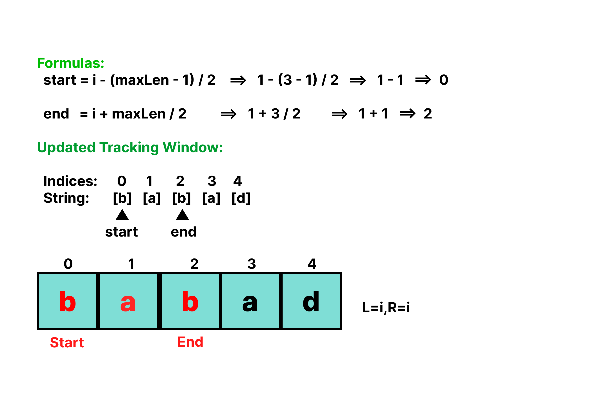

# Longest Palindrome Substring (Leetcode solution)
An elegant, highly optimized Java implementation to find the **Longest Palindromic Substring (LPS)** within a given text using the **Expand Around Center** strategy.

This approach balances extreme memory efficiency with excellent runtime performance, outperforming typical dynamic programming solutions.

---

## Example input and output
For an input string like "babad":

- At i = 1 (s.charAt(i) == 'a'), odd expansion yields "bab" (length 3).

- The algorithm tracks bounds start = 0 and end = 2.

- Subsequent scans find matches but none exceed length 3, safely terminating and slicing "bab" out cleanly.
---

## Algorithm Overview: "Expand Around Center"
- Instead of checking every possible substring (which takes a brutal $O(n^3)$ time), this algorithm conceptualizes every character—and every gap between characters—as a potential **center mirror** of a palindrome. 
- Pointers are placed at these centers and expanded outward simultaneously as long as the mirrored characters remain identical.

Because palindromes can be structural variants of symmetric lengths, the algorithm checks two distinct cases for each index $i$:
1. **Odd-Length Centers:** Pointers begin at the exact same character (`left = i`, `right = i`), matching patterns like `r-a-c-e-c-a-r`.
2. **Even-Length Centers:** Pointers begin at adjacent characters (`left = i`, `right = i + 1`), matching patterns like `n-o-o-n`.

---
## Diagram for "Expand Around Center"


---
##  Complexity Analysis

| Metric | Complexity | Technical Justification |
| :--- | :--- | :--- |
| **Time Complexity** | $\mathcal{O}(n^2)$ | There are exactly $2n - 1$ total potential centers (comprising $n$ odd centers and $n-1$ even centers). Expanding outwards from a single center to the edges takes at most $\mathcal{O}(n)$ steps, yielding a tight worst-case quadratic bound. |
| **Space Complexity** | $\mathcal{O}(1)$ | Unlike standard dynamic programming layouts which allocate an $\mathcal{O}(n^2)$ boolean matrix lookup table, this approach relies purely on primitive constant pointers (`left`, `right`, `start`, `end`), keeping auxiliary memory footprint virtually non-existent. |

---

## Code Architecture and Execution Flow
### ExpandFromMiddle(s, 1, 1)

```java
 private static int expandFromMiddle(String s, int left, int right) {
    // Expand outwards as long as bounds are valid and characters match
    while (left >= 0 && right < s.length() && s.charAt(left) == s.charAt(right)) {
        left--;
        right++;
    }
    // Return the length of the palindrome found
    return right - left - 1;
}
```
### Main looping with helper method
```java
  for (int i = 0; i < s.length(); i++) {
            // Case 1: Odd length palindrome (e.g., "aba", center is 'b')
            int len1 = expandFromMiddle(s, i, i);

            // Case 2: Even length palindrome (e.g., "abba", center is between 'b' and 'b')
            int len2 = expandFromMiddle(s, i, i + 1);

            // Get the maximum length found at this center
            int maxLen = Math.max(len1, len2);
            
        }

        // Return the actual substring using the tracked bounds
        return s.substring(start, end + 1);
```

## Demo diagram for main loop


---

## global window bound
```java
 // If we found a longer palindrome, update our tracking indices
            if (maxLen > (end - start)) {
                start = i - (maxLen - 1) / 2;
                end = i + maxLen / 2;
            }
```
### Diagram for maxlength


---


